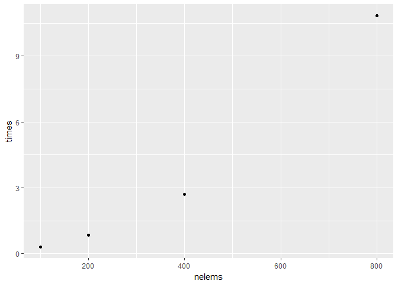
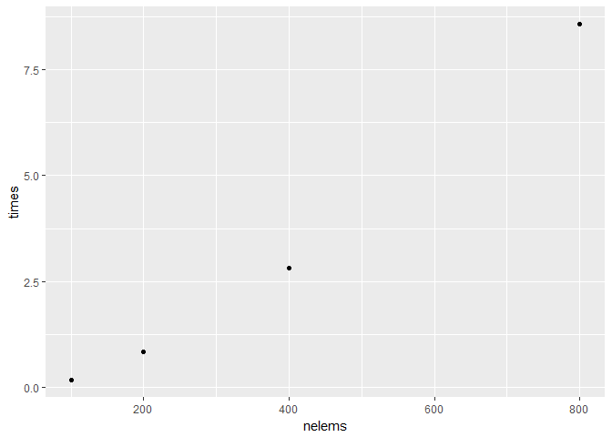
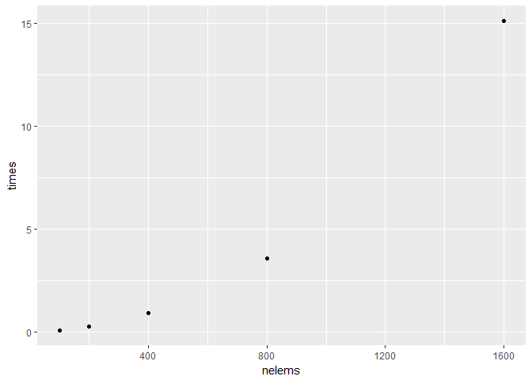
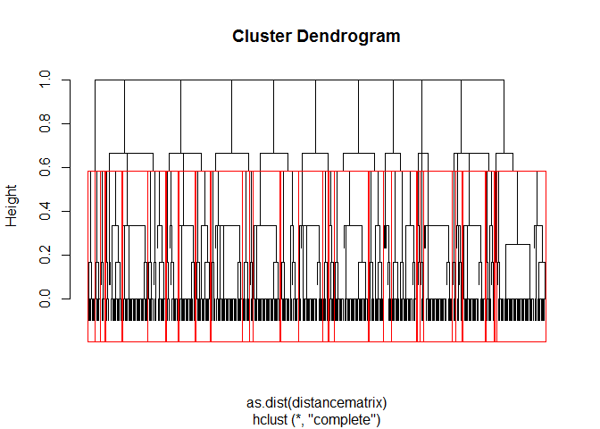
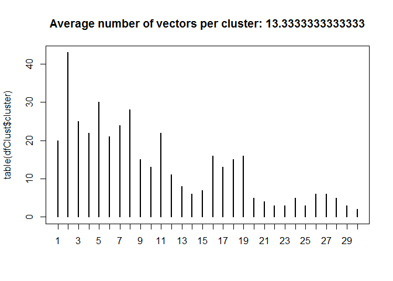

Parallel Clustering Algorithm
=============================

Given a list of groups, how are the groups related to each other?

Distance Matrix Calculation
---------------------------

Two helper functions:

1.  getSetOverlap: this measures the overlap between two sets of objects
2.  voverlap: this is a vectorized version that sets up fast computation
    of overlaps

<!-- -->

    getSetOverlap <- function(x,y){
      return(1 - (length(intersect(x,y))*(1/length(x) + 1/length(y))/2))
    }

    voverlap <- Vectorize(getSetOverlap, vectorize.args="x")

Given a list of vectors with random lengths, how similar are the vectors
to each other?

The first piece is to generate the list of letters, then calculate the
distance between the groups using the set intersection.

    nelem <- 4
    m1 <- rep(list(c()),nelem)
    for (i in 1:nelem){
      m1[[i]] <- sample(letters[1:3], sample(1:3,1))
    }
    mouter<-outer(m1,m1,Vectorize(getSetOverlap))
    print(m1)

    ## [[1]]
    ## [1] "c" "a" "b"
    ## 
    ## [[2]]
    ## [1] "c" "a"
    ## 
    ## [[3]]
    ## [1] "b"
    ## 
    ## [[4]]
    ## [1] "b" "c" "a"

    print(mouter)

    ##           [,1]      [,2]      [,3]      [,4]
    ## [1,] 0.0000000 0.1666667 0.3333333 0.0000000
    ## [2,] 0.1666667 0.0000000 1.0000000 0.1666667
    ## [3,] 0.3333333 1.0000000 0.0000000 0.3333333
    ## [4,] 0.0000000 0.1666667 0.3333333 0.0000000

The distance matrix is 0 if the vectors are identical, 1 if there is no
overlap at all, and somewhere between 0 and 1 depending on the overlap.

Now we test how long it takes to compute the distance matrix using the
base `outer` function.

    #Timing test

    nelems <- c(100,200,400,800)
    times <- c()

    for (nelem in nelems){
      st <- Sys.time()
      m1 <- rep(list(c()),nelem)
      for (i in 1:nelem){
        m1[[i]] <- sample(letters, sample(1:10,1))
      }
      mouter<-outer(m1,m1,Vectorize(getSetOverlap))
      
      times <- c(times, difftime(Sys.time(),st,units="secs"))
    }

    qplot(nelems,times)

Comparing the performance of the `outer` version with the `sapply`
version.

    nelems <- c(100,200,400,800)
    times <- c()

    for (nelem in nelems){
      st <- Sys.time()
      m1 <- rep(list(c()),nelem)
      for (i in 1:nelem){
        m1[[i]] <- sample(letters, sample(1:10,1))
      }
      msapply<-sapply(m1, function(x) voverlap(m1,x))
      
      times <- c(times, difftime(Sys.time(),st,units="secs"))
    }

    qplot(nelems,times)

There is a little performace speed-up. However, are they the same
result? We check that.

    nelem <- 100

    m1 <- rep(list(c()),nelem)
    for (i in 1:nelem){
      m1[[i]] <- sample(letters, sample(1:10,1))
    }

    mouter<-outer(m1,m1,Vectorize(getSetOverlap))

    msapply<-sapply(m1, function(x) voverlap(m1,x))

    identical(mouter,msapply)

    ## [1] TRUE

So they give the same result. Now looking at the parallelized version
timing.

    no_cores <- detectCores()
     
    # Initiate cluster
    cl <- makeCluster(no_cores)

    clusterExport(cl,"voverlap")

    nelems <- c(100,200,400,800,1600)
    times <- c()

    for (nelem in nelems){
      st <- Sys.time()
      m1 <- rep(list(c()),nelem)
      
      for (i in 1:nelem){
        m1[[i]] <- sample(letters, sample(1:10,1))
      }
      clusterExport(cl, "m1")
      
      distancematrix<-parSapply(cl, m1, function(x) voverlap(m1,x))
      
      times <- c(times, difftime(Sys.time(),st,units="secs"))
    }

    stopCluster(cl)

    qplot(nelems,times)

On a dual-core machine, the parallelized version gives a speedup of a
factor of 2. This scales linearly by cores, since the distance matrix
calculation is parallelizable.

Clustering
----------

At this point we want to cluster the vectors based on their hierarchical
relationship. We base the next piece of code on [this
analysis](https://amunategui.github.io/stringdist/).

We choose the number of clusters to make based on the shape of the
dendrogram.

    nelem <- 400
    m1 <- rep(list(c()),nelem)
    for (i in 1:nelem){
      m1[[i]] <- sample(letters[1:10], sample(1:3,1))
    }

    distancematrix<-sapply(m1, function(x) voverlap(m1,x))
    num_clusters <- 30
    hc <- hclust(as.dist(distancematrix))
    plot(hc,labels=FALSE)

    rect.hclust(hc,k=num_clusters)

Now that the vectors are clustered, we look at how many vectors are in
each cluster.

    dfClust <- data.frame(seq(1:length(m1)), cutree(hc, k=num_clusters))
    names(dfClust) <- c('Vname','cluster')

    dfClust$Vname <- sapply(m1, function(x) paste(sort(x), collapse=""))

    # visualize the groupings
    plot(table(dfClust$cluster))
    title(paste('Average number of vectors per cluster:', mean(table(dfClust$cluster))))

Now we look at the top few groups and see how they are grouped.

    # lets look at the top groups and see what the algorithm did:

    # Order clusters by size
    t <- table(dfClust$cluster)
    t <- cbind(t,t/length(dfClust$cluster))
    t <- t[order(t[,2], decreasing=TRUE),]
    p <- data.frame(factorName=rownames(t), binCount=t[,1], percentFound=t[,2])

    dfClust <- merge(x=dfClust, y=p, by.x = 'cluster', by.y='factorName', all.x=T)

    dfClust <- dfClust[rev(order(dfClust$binCount)),]

    dfClust<-dfClust[c('Vname','cluster')]

    topclusters <- as.numeric(as.character(head(p$factorName)))

    for (k in topclusters){
      writeLines(paste("Cluster number:",k))
      writeLines("------")
      writeLines(paste(dfClust[dfClust$cluster == k,"Vname"], collapse="\n"))
      writeLines("------")
      
    }

    ## Cluster number: 2
    ## ------
    ## a
    ## a
    ## ab
    ## ac
    ## a
    ## a
    ## a
    ## a
    ## agh
    ## ac
    ## ac
    ## ag
    ## ab
    ## a
    ## a
    ## ab
    ## a
    ## ag
    ## a
    ## adg
    ## a
    ## ab
    ## abg
    ## adg
    ## a
    ## a
    ## ag
    ## a
    ## ag
    ## a
    ## agj
    ## a
    ## a
    ## a
    ## ag
    ## a
    ## ab
    ## a
    ## ac
    ## ac
    ## agj
    ## a
    ## ag
    ## ------
    ## Cluster number: 5
    ## ------
    ## d
    ## d
    ## ad
    ## ade
    ## ad
    ## dh
    ## d
    ## dh
    ## d
    ## d
    ## adh
    ## adh
    ## dh
    ## d
    ## abd
    ## d
    ## dh
    ## dh
    ## ad
    ## ad
    ## ad
    ## abd
    ## d
    ## d
    ## d
    ## ad
    ## dh
    ## abd
    ## abd
    ## d
    ## ------
    ## Cluster number: 8
    ## ------
    ## i
    ## dhi
    ## i
    ## i
    ## i
    ## fhi
    ## hi
    ## i
    ## di
    ## i
    ## ghi
    ## di
    ## ghi
    ## bhi
    ## i
    ## i
    ## hi
    ## bhi
    ## i
    ## i
    ## ehi
    ## i
    ## i
    ## dhi
    ## hi
    ## i
    ## ehi
    ## bhi
    ## ------
    ## Cluster number: 3
    ## ------
    ## b
    ## b
    ## b
    ## b
    ## b
    ## b
    ## b
    ## bhj
    ## bj
    ## b
    ## bj
    ## b
    ## bj
    ## bfj
    ## b
    ## b
    ## b
    ## b
    ## b
    ## b
    ## bdj
    ## bj
    ## b
    ## b
    ## b
    ## ------
    ## Cluster number: 7
    ## ------
    ## ahj
    ## h
    ## ah
    ## h
    ## h
    ## h
    ## ahj
    ## h
    ## ah
    ## h
    ## abh
    ## h
    ## h
    ## h
    ## h
    ## ahj
    ## abh
    ## h
    ## ah
    ## ah
    ## h
    ## h
    ## h
    ## h
    ## ------
    ## Cluster number: 4
    ## ------
    ## e
    ## eh
    ## e
    ## beh
    ## eh
    ## e
    ## eh
    ## abe
    ## be
    ## ae
    ## e
    ## be
    ## beh
    ## bce
    ## abe
    ## e
    ## ae
    ## be
    ## e
    ## beh
    ## eh
    ## e
    ## ------

We've put the groups of vectors into clusters based on their closest
neighbors.
